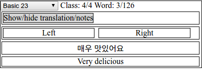
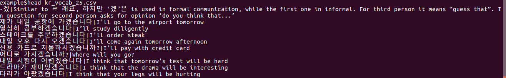
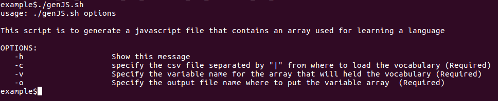
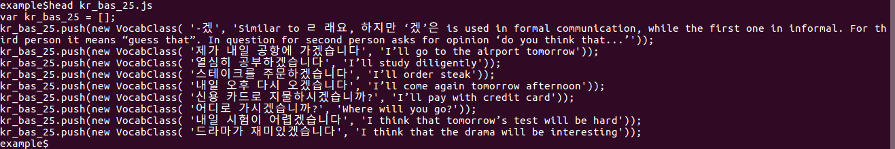
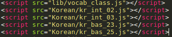
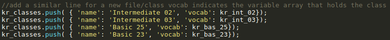

#Language word list
###Using: Javascript, Linux bash, Jquery
This repository enables to have a little web application using the web browser in the client side only. While studying a foreign language it is required to test our memory and recall what have just been read. A solution to this are the flahscards such as Enki, nonetheless, it takes a lot of time to create the cards with an own vocabulary set and the installation for linux users or other not full supported Operative Systems gets complicated and full of errors. 

To solve that, I provide a little, not so fancy, "flashcard system" that loads a vocabulary set "Foreign terminology + translation" from a csv file (Separated by a **|** pipe sign ).

The upper part contains the list of **classes** available from a drop down list. Next to it is the index for the classes and the index of the word in the class.
Below, is a button that when pressed shows or hides the translation section.
To change the word in the sed press the **Left** and **Right** buttons.

##Creating a new class
####1) Having a csv file ready

In the image it is possible to see that each line is separated by a **|** between the Korean sentence and the one in English.
####2) Converting the csv to a js file
The repository holds a file **genJS.sh** 

So, to create the required file we could use:

	./genJS.sh -c kr_vocab_25.csv -v kr_bas_25 -o kr_bas_25.js
This will create a file named **kr_bas_25.js** that contains the following:

It comprenhends a Javascript array with name **kr_bas_25** that holds the content from the csv file we specified.
The class **VocabClass** is present in the **lib/** folder.
####3) Loading the js file to the website file
#####3.1) Add the js file to the header
The head contains the following files already

The js files were put in the **Korean/**  folder. when generating a new js file add this in this section.
#####3.2) Add the variable to the array that holds all the 'classes'

The content you put in the **'name'** part is the value that will appear in the **select** dropdown list and the value you put in the **'vocab'** part is the variable created, present in the new .js file

